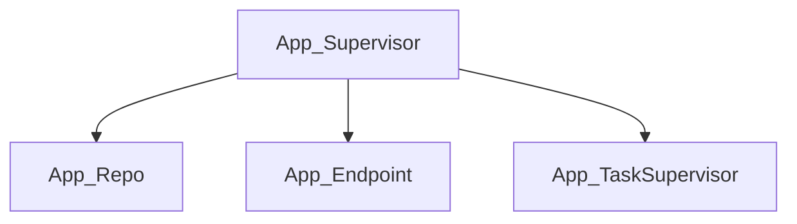
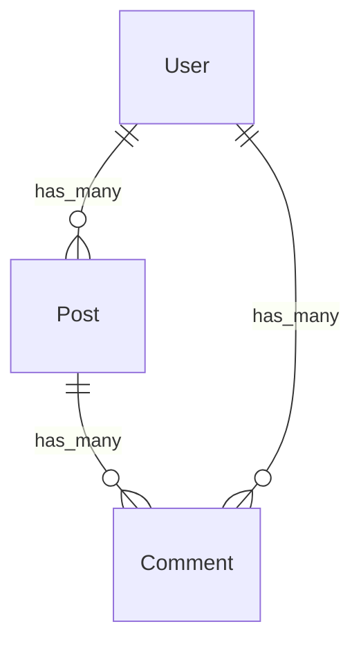
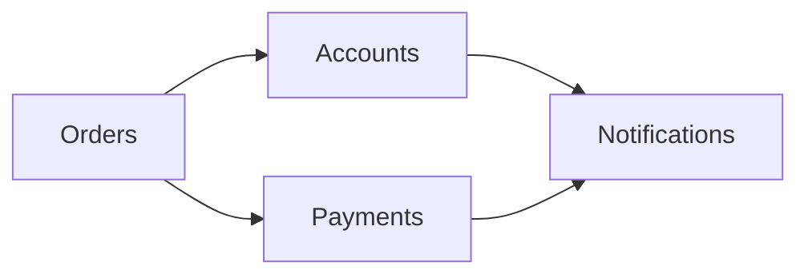
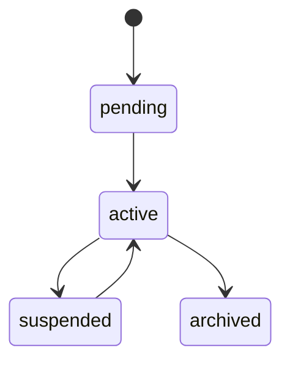

# 🗺️ Elixir Cartographer

Reverse-engineer any Elixir codebase into LLM-ready documentation. Point it at a project and get a comprehensive `AGENTS.md` — modules, schemas, supervision trees, workflows, routes, git history, test coverage, and more.

Built for the [AGENTS.md convention](https://docs.github.com/en/copilot/customizing-copilot/adding-repository-custom-instructions) used by Claude Code, Copilot, Cursor, and other AI coding agents.

## What It Finds

| Layer | What's Analyzed |
|-------|----------------|
| **Static Analysis** | Module graph & dependencies, Ecto schemas & associations, GenServers / Supervisors / process architecture, Phoenix routes, **LiveView / LiveComponent / function component analysis**, config matrix, error taxonomy, workflow & state machines |
| **Git Mining** | Commit classification, bug hotspot detection, contributor rankings, code evolution over time |
| **Test Mining** | Test inventory, edge cases, coverage gaps |
| **Synthesis** | Combines all layers into structured `AGENTS.md` + context docs |

## Quick Start

### As a Mix Task (recommended)

Clone the repo and run from within it:

```bash
git clone https://github.com/your-org/elixir_cartographer.git
cd elixir_cartographer
mix deps.get
mix compile

# Map any Elixir project
mix cartographer.map /path/to/your/elixir/project
```

### As an Escript

Build a standalone binary:

```bash
cd elixir_cartographer
mix escript.build

# Run it anywhere
./elixir_cartographer /path/to/your/elixir/project
```

### Programmatic Usage

Add to your project's `mix.exs` (or use as a path dependency):

```elixir
def deps do
  [
    {:elixir_cartographer, path: "/path/to/elixir_cartographer"}
  ]
end
```

Then call directly:

```elixir
ElixirCartographer.map("/path/to/project", output: "./docs")
```

## Options

| Flag | Short | Description | Default |
|------|-------|-------------|---------|
| `--output` | `-o` | Output directory | `<project>/cartographer_docs` |
| `--name` | `-n` | Project name | Auto-detected from `mix.exs` |
| `--compact` | `-c` | Generate condensed output optimized for token efficiency | `false` |
| `--skip-git` | | Skip git history analysis | `false` |
| `--skip-tests` | | Skip test file analysis | `false` |
| `--verbose` | `-v` | Verbose output | `false` |

## Compact Mode

Use `--compact` / `-c` to generate a condensed AGENTS.md optimized for token efficiency. This produces ~500-800 lines instead of 3,000+ by using one-liner formats for all data categories:

```bash
mix cartographer.map /path/to/project --compact
```

**When to use compact mode:**
- When your AI agent has limited context windows
- For quick overviews of large codebases
- When you need to fit the codebase map alongside other context

**Compact output example:**

```markdown
# AGENTS.md — MyApp
> Cartographer v0.1.0 | 572 modules | 71 schemas | 8,047 commits

## Accounts (23 modules)
- Accounts — list_users/0, get_user!/1, create_user/1, update_user/1
- User (users) — id:id, email:string, name:string, status:string | has_many → Post
- UserToken (users_tokens) — id:id, user_id:references, token:binary
- GenServer: SessionStore (init, handle_call, handle_info)
- Workflow: User [status] — pending → active → suspended → archived

## Web (45 modules)
- GET / → PageController.index
- POST /users → UserController.create
- LIVE /dashboard → DashboardLive
- Component: CoreComponents — attrs: flash, label | slots: inner_block, actions
```

## Mermaid Diagrams

Both full and compact modes include Mermaid diagrams for visual architecture maps. Full mode includes all four diagram types; compact mode includes only the Schema ERD and Context Dependency Graph.

**Supervision Tree** (full mode only):


**Schema ERD**:


**Context Dependency Graph**:


**Workflow State Diagrams** (full mode only):


## Example

```bash
$ mix cartographer.map /path/to/my_app --output ./docs --verbose

═══════════════════════════════════════════════════
  Elixir Cartographer v0.1.0
═══════════════════════════════════════════════════

Analyzing: /path/to/my_app
Output:    ./docs

──── Layer 1: Static Analysis ────
✓ Module graph analysis — Found 572 modules
✓ Ecto schema extraction — Found 71 schemas
✓ Process architecture — Found 13 GenServers, 8 Supervisors
✓ Route mapping — Found 245 routes
✓ LiveView analysis — Found 12 LiveViews, 8 components, 15 function components
✓ Config matrix — Found 89 config keys
✓ Error taxonomy — Found 34 error types
✓ Workflow detection — Found 14 state machines

──── Layer 2: Git Mining ────
✓ Commit analysis — 8,047 commits classified
✓ Hotspot detection — 23 bug hotspots identified

──── Layer 3: Test Mining ────
✓ Test inventory — 1,204 tests across 87 files

──── Layer 4: Synthesis ────
✓ AGENTS.md generated — 3,300 lines
✓ Context docs written

Done in 12.4s → ./docs/
```

## Output

The tool generates:

```
docs/
├── AGENTS.md            # Complete codebase map for LLM agents
└── context/
    ├── module_graph.md  # Module dependency graph
    ├── schemas.md       # Ecto schema reference
    ├── processes.md     # Supervision tree & GenServers
    ├── routes.md        # Phoenix route map
    ├── workflows.md     # State machines & workflows
    ├── git_insights.md  # Hotspots, contributors, evolution
    └── test_coverage.md # Test inventory & gaps
```

### AGENTS.md Structure

The generated `AGENTS.md` includes:

- **Project overview** — name, Elixir/OTP version, dependencies
- **Architecture** — bounded contexts, module clusters, dependency graph
- **Data model** — all Ecto schemas with fields, types, associations
- **Process architecture** — supervision trees, GenServers, state management
- **API surface** — Phoenix routes with controllers and plugs
- **Workflows** — state machines with transitions and guards
- **Configuration** — all config keys by environment
- **Error handling** — error types, rescue patterns, fallback strategies
- **Git insights** — bug hotspots (most-fixed files), contributor expertise, code churn
- **Test coverage** — what's tested, what's missing, edge cases found
- **Development guide** — how to run, test, and deploy

## Wiring It Into Your Project

The generated docs are only useful if your AI coding agent actually reads them. Here's how to reference them from your project's root `AGENTS.md`:

### Option 1: Direct Reference (recommended)

Add a section to your project's `AGENTS.md` pointing to the generated docs:

```markdown
## Codebase Map

See [cartographer_docs/AGENTS.md](./cartographer_docs/AGENTS.md) for the full
auto-generated codebase map including module graph, schemas, processes, routes,
workflows, git hotspots, and test coverage.

Per-context deep dives: [cartographer_docs/contexts/](./cartographer_docs/contexts/)
```

### Option 2: Inline Include

For agents that only read the root `AGENTS.md`, paste a summary and link the details:

```markdown
## Codebase Map

> Auto-generated by Elixir Cartographer — regenerate with:
> `mix cartographer.map . --output ./cartographer_docs`

- **572 modules** across 14 contexts
- **71 Ecto schemas** — see [full data model](./cartographer_docs/AGENTS.md#data-model)
- **13 GenServers, 8 Supervisors** — see [process architecture](./cartographer_docs/AGENTS.md#process-architecture)
- **245 routes** — see [API surface](./cartographer_docs/AGENTS.md#api-surface)
- **14 state machines** — see [workflows](./cartographer_docs/AGENTS.md#workflows--state-machines)
- **23 bug hotspots** — see [git insights](./cartographer_docs/AGENTS.md#git-insights)
```

### Option 3: Replace Your AGENTS.md Entirely

If you don't have a hand-written `AGENTS.md` yet, just output directly to the root:

```bash
mix cartographer.map . --output .
```

This writes `AGENTS.md` to the project root — ready for Claude Code, Copilot, Cursor, and friends.

### Keeping It Fresh

Re-run after significant changes to keep the map current:

```bash
# Add to CI or a git hook
mix cartographer.map . --output ./cartographer_docs

# Or skip slow layers for quick refreshes
mix cartographer.map . --skip-git --skip-tests --output ./cartographer_docs
```

## Architecture

```
┌─────────────────────────────────────────────────┐
│                    Pipeline                      │
├─────────────┬──────────┬──────────┬─────────────┤
│   Layer 1   │ Layer 2  │ Layer 3  │   Layer 4   │
│   Static    │   Git    │  Tests   │  Synthesis  │
│  Analysis   │  Mining  │  Mining  │             │
├─────────────┼──────────┼──────────┤             │
│ ModuleGraph │ GitMiner │TestMiner │ AGENTS.md   │
│ EctoSchemas │          │          │ ContextDocs │
│ ProcessArch │          │          │             │
│ RouteMapper │          │          │             │
│ LiveViewAna │          │          │             │
│ ConfigMatrix│          │          │             │
│ ErrorTaxon  │          │          │             │
│ WorkflowDet │          │          │             │
└─────────────┴──────────┴──────────┴─────────────┘
```

## Requirements

- Elixir ~> 1.14
- Erlang/OTP 25+
- Git (for git mining layer)
- Target project must be a Mix project

## Tests

```bash
mix test           # 136 tests
mix test --trace   # with test names
```

## License

MIT

## Author

Wayne Pringle-Wood
